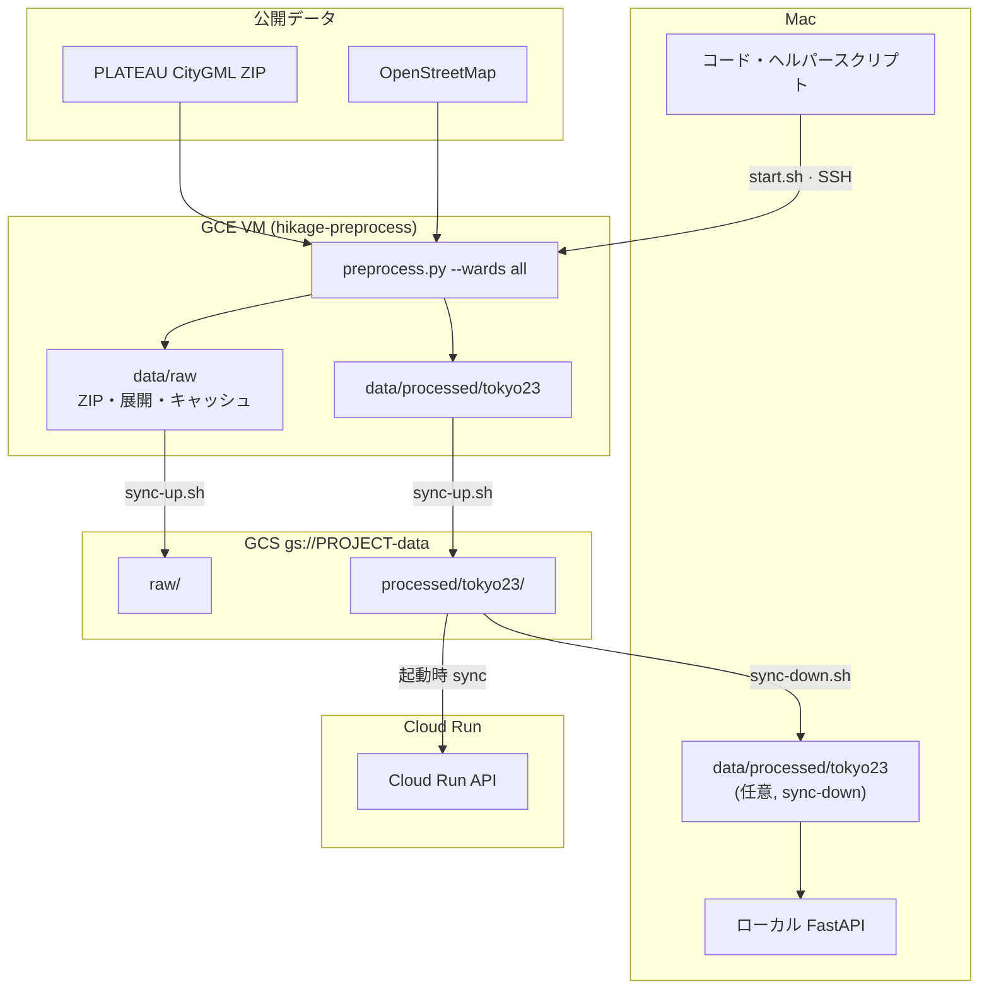
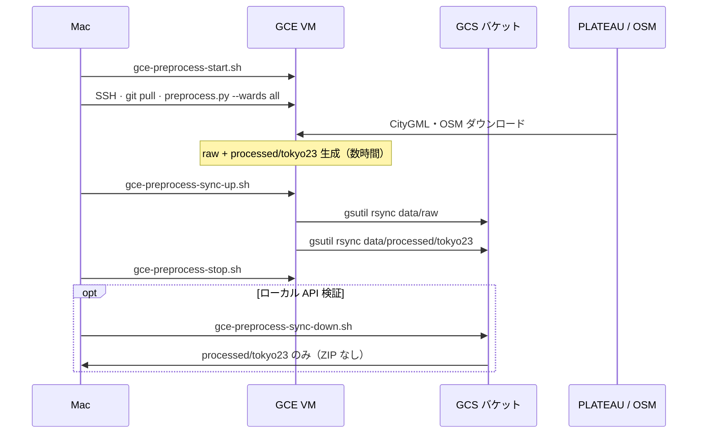

# hikage-navi (日陰ナビ)

[한국어](README.md) | **日本語**

**東京23区**を歩く人向けの、**日陰ルート案内**パイロットです。（渋谷単区のデータ・fixtures でも動作）

韓国の[그늘로](https://ttubeok.com/)を参考にしていますが、公共交通・車窓の日当たり・街路樹は入れません。  
23区内で出発地と到着地を指定すると、**最短の徒歩ルート**と**日陰が多い徒歩ルート**を比べられます。  
各ルートの連続直射日光と、近くの給水スポットも表示します。

ローカルでは Web・API・実データまで動くデモが使えます。  
23区の前処理は Mac のディスク不足のため **GCE VM + GCS** で行います。  
CI は GitHub Actions です。API は Cloud Run 起動時に GCS の `processed/tokyo23` を sync します。Web の公開デプロイ（Vercel）はまだです。

## いまできること

- 東京23区（または渋谷区）の地図に、時刻ごとの建物の影を表示する
- 地図をタップして出発・到着を指定する
- 最短ルートと日陰ルートを比較する（距離・時間・日陰%）
- ルートごとの最大連続直射日光（距離・時間）
- 選択中ルートから約 50 m 以内の給水スポット（ON/OFF）
- 夜間は最短ルートのみ（日陰・連続直射日光は計算しない）

## やらないこと

鉄道・バス、車窓の推薦、街路樹、地下街、場所検索、ネイティブアプリ、ログイン。  
給水スポットは経由地や重みには使いません。

## 次にやること

- Web の公開デプロイ: Vercel（[docs/07-gcp-cicd.md](docs/07-gcp-cicd.md)）— まだ
- 23区の raw・前処理は GCE VM + GCS（[docs/08-gce-preprocess.md](docs/08-gce-preprocess.md)）— Mac に `data/raw` を置かない

## 技術

| 層 | 選択 |
| --- | --- |
| Web | TypeScript, React, Vite, MapLibre |
| API | Python, FastAPI |
| CI | GitHub Actions（`pytest` + `vitest`） |
| Web の公開 | Vercel（予定） |
| API の公開 | Cloud Build → Artifact Registry → Cloud Run（起動時 GCS sync） |
| 前処理データ | GCE（作業）+ GCS（保管） |

背景地図は国土地理院タイルをブラウザが直接取得します。  
当アプリの API が返すのは区境界（`/boundary`）、建物の影（`/shadows`）、ルートと給水（`/routes`）だけです。

## データ・前処理（GCE + GCS）

**前処理**は PLATEAU CityGML・OSM などの公開データを、API が読む GeoJSON・歩行グラフ（`data/processed/`）に **事前変換**するバッチです。  
23区全体の raw は数十 GB のため Mac には置かず、**GCE VM で実行**し **GCS を正規保管**とします。更新は **手動**（スケジュール・CI 自動化なし）。

### ストレージの役割



### 手動サイクル（毎回）



| スクリプト | 役割 |
| --- | --- |
| `scripts/gce-preprocess-start.sh` | VM 起動 |
| `scripts/gce-preprocess-stop.sh` | VM 停止（課金抑制） |
| `scripts/gce-preprocess-sync-up.sh` | VM → GCS（`raw`, `processed/tokyo23`） |
| `scripts/gce-preprocess-sync-down.sh` | GCS → Mac（`processed/tokyo23` のみ） |

```bash
export HIKAGE_GCP_PROJECT=your-gcp-project   # バケット: gs://${PROJECT}-data

./scripts/gce-preprocess-start.sh
# VM SSH 後: python api/scripts/preprocess.py --wards all
./scripts/gce-preprocess-sync-up.sh
./scripts/gce-preprocess-stop.sh
./scripts/gce-preprocess-sync-down.sh        # 任意
```

詳細・VM 初回セットアップ: [docs/08-gce-preprocess.md](docs/08-gce-preprocess.md).

## ローカル起動（要約）

```bash
# API（ターミナル 1）— tokyo23 processed があれば自動認識
export HIKAGE_DATA_DIR=/path/to/hikage-navi/data/processed/tokyo23
cd api && . .venv/bin/activate && uvicorn hikage_navi.app:app --port 8000

# Web（ターミナル 2）
cd web && npm run dev
```

- API: `http://127.0.0.1:8000`（`/health`, `/docs`）
- Web: `http://127.0.0.1:5173`

渋谷のみのときは `HIKAGE_DATA_DIR=.../data/processed`（既定の `shibuya-*`）。  
`data/raw` は gitignore で **Mac に置かない**。実行時に Overpass は呼びません。

## CI

`master` への push と pull request のとき [`.github/workflows/test.yml`](.github/workflows/test.yml) が API・Web の単体テストを並列実行します。  
デプロイ（CD）は GitHub Actions では行いません。

```bash
cd api && pytest tests/ -v
cd web && npm test
```

## 仕様

実装は次の文書に従います（本文は한국어です）。

| 文書 | 内容 |
| --- | --- |
| [docs/01-requirements.md](docs/01-requirements.md) | 要件定義 |
| [docs/02-functional-spec.md](docs/02-functional-spec.md) | 機能仕様 |
| [docs/03-ui-spec.md](docs/03-ui-spec.md) | 画面仕様 |
| [docs/04-data-algorithm.md](docs/04-data-algorithm.md) | データ・アルゴリズム |
| [docs/05-acceptance.md](docs/05-acceptance.md) | 受け入れ基準 |
| [docs/06-tech-stack.md](docs/06-tech-stack.md) | 技術選定 |
| [docs/07-gcp-cicd.md](docs/07-gcp-cicd.md) | Vercel / GCP CI/CD |
| [docs/08-gce-preprocess.md](docs/08-gce-preprocess.md) | GCE 前処理 + GCS 保管 |
| [docs/superpowers/plans/2026-08-14-hikage-navi-v0.1.md](docs/superpowers/plans/2026-08-14-hikage-navi-v0.1.md) | v0.1 実装計画（タスク 1–14） |
| [FeatureAddition.md](FeatureAddition.md) | 連続直射日光・給水スポットの要求 |
| [docs/superpowers/plans/2026-08-18-continuous-sun-water-spots.md](docs/superpowers/plans/2026-08-18-continuous-sun-water-spots.md) | 上記機能の実装計画 |

## データの出典

- 地図: [国土地理院](https://maps.gsi.go.jp/development/ichiran.html)
- 建物: [Project PLATEAU](https://www.mlit.go.jp/plateau/)（渋谷区）
- 道路・給水: [OpenStreetMap](https://www.openstreetmap.org/copyright)

採用・保留（ほこナビDP、街路樹、Cool Share など）は [docs/04-data-algorithm.md](docs/04-data-algorithm.md) §1.6 を参照。

## 進捗

- [x] 要件・機能仕様
- [x] API コア（タスク 1–5）
- [x] FastAPI・Web UI・渋谷実データ・受け入れ検証（タスク 6–10）
- [x] 連続直射日光・ルート周辺の給水スポット
- [x] GitHub Actions CI
- [x] API Docker / Cloud Build 設定（`Dockerfile.api`, `cloudbuild.yaml`）
- [x] モバイル Web UI（タスク 11）
- [x] 東京23区への拡大（タスク 12–14）
- [x] GCE 前処理・GCS 保管の文書・スクリプト
- [x] API Cloud Run ・起動時 GCS sync
- [ ] Web の公開デプロイ（Vercel）
