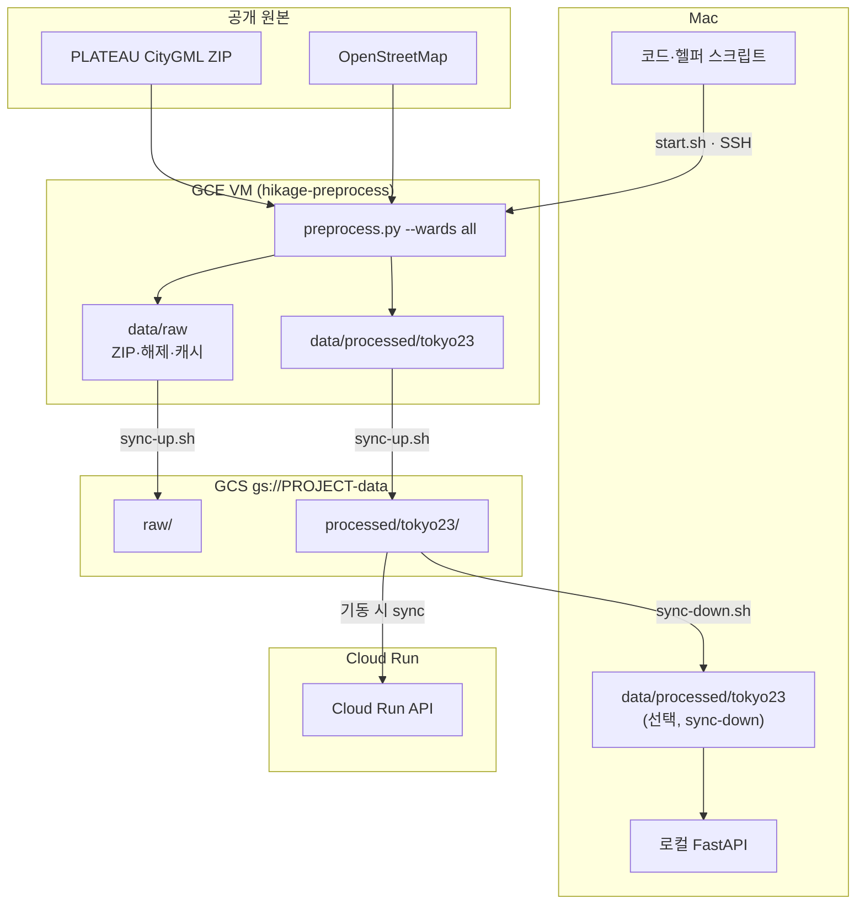
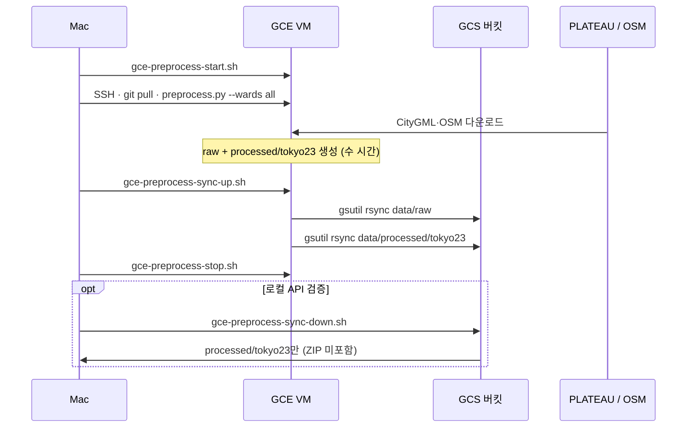

# hikage-navi (日陰ナビ)

**한국어** | [日本語](README.ja.md)

**東京23区** 보행자를 위한 **그늘 길찾기** 파일럿입니다. (시부야 단일 구 데이터·fixtures로도 동작)

한국의 [그늘로](https://ttubeok.com/)를 참고하되, 대중교통·버스 창가·가로수는 넣지 않습니다.  
23区内에서 출발·도착을 찍으면 **최단 도보**와 **그늘이 더 많은 도보**를 비교합니다.  
경로마다 연속 직사광선과 근처 급수 스팟도 보여 줍니다.

로컬에서 웹·API·실데이터까지 동작하는 데모를 사용할 수 있습니다.  
23区 전처리는 Mac 디스크 한계 때문에 **GCE VM + GCS**로 돌립니다.  
CI는 GitHub Actions입니다. API는 Cloud Run에서 기동 시 GCS `processed/tokyo23`을 sync합니다. 웹 공개 배포(Vercel)는 아직입니다.

## 하는 일 (지금)

- 東京23区(또는 시부야) 지도에 시간대별 건물 그림자 표시
- 지도 탭으로 출발·도착 지정
- 최단 경로 vs 그늘 경로 (거리, 시간, 그늘 %)
- 경로마다 최대 연속 직사광선 거리·시간
- 선택한 경로 약 50 m 안의 급수 스팟 (ON/OFF)
- 밤에는 최단 경로만 (그늘·연속 직사광선은 계산하지 않음)

## 쓰지 않는 것

전철·버스, 창가 추천, 가로수, 지하가, 장소 검색, 네이티브 앱, 로그인.  
급수는 경로 경유지나 가중치로 쓰지 않습니다.

## 다음

- 웹 공개 배포: Vercel ([docs/07-gcp-cicd.md](docs/07-gcp-cicd.md)) — 아직
- 23区 raw·전처리는 GCE VM + GCS ([docs/08-gce-preprocess.md](docs/08-gce-preprocess.md)) — Mac에 `data/raw`를 두지 않음

## 기술

| 층 | 선택 |
| --- | --- |
| 웹 | TypeScript, React, Vite, MapLibre |
| API | Python, FastAPI |
| CI | GitHub Actions (`pytest` + `vitest`) |
| 웹 배포 | Vercel (예정) |
| API 배포 | Cloud Build → Artifact Registry → Cloud Run (기동 시 GCS sync) |
| 전처리 데이터 | GCE (작업) + GCS (보관) |

배경 지도는 국토지리원 타일을 브라우저가 직접 받습니다.  
우리 API는 구 경계(`/boundary`), 건물 그림자(`/shadows`), 경로·급수(`/routes`)만 줍니다.

## 데이터·전처리 (GCE + GCS)

**전처리**는 PLATEAU CityGML·OSM 같은 공개 원본을, API가 읽을 GeoJSON·보행 그래프(`data/processed/`)로 **미리** 바꾸는 배치 작업이다.  
23区 전체 raw는 수십 GB라 Mac에 두지 않고, **작업용 GCE VM**에서 돌린 뒤 **GCS가 정식 보관소**가 된다. 갱신은 **수동**이다 (스케줄·CI 자동화 없음).

### 저장소 역할



### 수동 사이클 (매회)



| 스크립트 | 역할 |
| --- | --- |
| `scripts/gce-preprocess-start.sh` | VM start |
| `scripts/gce-preprocess-stop.sh` | VM stop (과금 절감) |
| `scripts/gce-preprocess-sync-up.sh` | VM → GCS (`raw`, `processed/tokyo23`) |
| `scripts/gce-preprocess-sync-down.sh` | GCS → Mac (`processed/tokyo23`만) |

```bash
export HIKAGE_GCP_PROJECT=your-gcp-project   # 버킷: gs://${PROJECT}-data

./scripts/gce-preprocess-start.sh
# VM SSH 후: python api/scripts/preprocess.py --wards all
./scripts/gce-preprocess-sync-up.sh
./scripts/gce-preprocess-stop.sh
./scripts/gce-preprocess-sync-down.sh        # 선택
```

상세·VM 최초 세팅: [docs/08-gce-preprocess.md](docs/08-gce-preprocess.md).

## 로컬 실행 (요약)

```bash
# API (터미널 1) — tokyo23 processed가 있으면 자동 인식
export HIKAGE_DATA_DIR=/path/to/hikage-navi/data/processed/tokyo23
cd api && . .venv/bin/activate && uvicorn hikage_navi.app:app --port 8000

# 웹 (터미널 2)
cd web && npm run dev
```

- API: `http://127.0.0.1:8000` (`/health`, `/docs`)
- 웹: `http://127.0.0.1:5173`

시부야만 쓸 때는 `HIKAGE_DATA_DIR=.../data/processed`(기본 `shibuya-*` 파일).  
`data/raw`는 gitignore이며 **Mac에 두지 않는다**. 런타임에 Overpass를 부르지 않는다.

## CI

`master` push와 pull request 때 [`.github/workflows/test.yml`](.github/workflows/test.yml)이 API·웹 단위 테스트를 병렬로 돌립니다.  
배포(CD)는 GitHub Actions가 하지 않습니다.

```bash
cd api && pytest tests/ -v
cd web && npm test
```

## 사양

구현은 아래 문서를 기준으로 합니다.

| 문서 | 내용 |
| --- | --- |
| [docs/01-requirements.md](docs/01-requirements.md) | 요건 정의 |
| [docs/02-functional-spec.md](docs/02-functional-spec.md) | 기능 사양 |
| [docs/03-ui-spec.md](docs/03-ui-spec.md) | 화면 사양 |
| [docs/04-data-algorithm.md](docs/04-data-algorithm.md) | 데이터·알고리즘 |
| [docs/05-acceptance.md](docs/05-acceptance.md) | 수용 기준 |
| [docs/06-tech-stack.md](docs/06-tech-stack.md) | 기술 선택 |
| [docs/07-gcp-cicd.md](docs/07-gcp-cicd.md) | Vercel / GCP CI/CD |
| [docs/08-gce-preprocess.md](docs/08-gce-preprocess.md) | GCE 전처리 + GCS 보관 |
| [docs/superpowers/plans/2026-08-14-hikage-navi-v0.1.md](docs/superpowers/plans/2026-08-14-hikage-navi-v0.1.md) | v0.1 구현 계획 (태스크 1–14) |
| [FeatureAddition.md](FeatureAddition.md) | 연속 직사광선·급수 스팟 요구 |
| [docs/superpowers/plans/2026-08-18-continuous-sun-water-spots.md](docs/superpowers/plans/2026-08-18-continuous-sun-water-spots.md) | 위 기능 구현 계획 |

## 데이터 출처

- 지도: [국토지리원](https://maps.gsi.go.jp/development/ichiran.html)
- 건물: [Project PLATEAU](https://www.mlit.go.jp/plateau/) (渋谷区)
- 도로·급수: [OpenStreetMap](https://www.openstreetmap.org/copyright)

채택·보류(ほこナビDP, 가로수, Cool Share 등)는 [docs/04-data-algorithm.md](docs/04-data-algorithm.md) §1.6을 본다.

## 상태

- [x] 요건·기능 사양
- [x] API 코어 (태스크 1–5)
- [x] FastAPI · 웹 UI · 시부야 실데이터 · 수용 검증 (태스크 6–10)
- [x] 연속 직사광선 · 경로 주변 급수 스팟
- [x] GitHub Actions CI
- [x] API Docker / Cloud Build 설정 파일 (`Dockerfile.api`, `cloudbuild.yaml`)
- [x] 모바일 웹 UI (태스크 11)
- [x] 東京23区 문안·전처리 (태스크 12–13)
- [x] 東京23区 런타임 로드 (태스크 14)
- [x] GCE 전처리·GCS 보관 문서·스크립트
- [x] API Cloud Run · 기동 시 GCS sync
- [ ] 웹 공개 배포 (Vercel)
